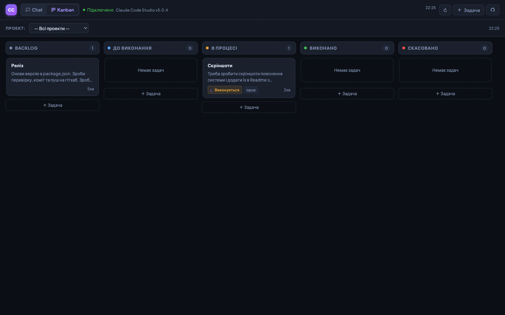

# Claude Code Studio

**The browser interface for Claude Code CLI.** Chat with AI, run tasks on autopilot, and manage your projects — all from one tab.

> [English](README.md) | [Українська](README_UA.md) | [Русский](README_RU.md)

> 📖 [From Terminal to Dashboard](https://www.notion.so/From-Terminal-to-Dashboard-How-Claude-Code-Studio-Changes-AI-Assisted-Development-329676bbc5b6809f9c63e29ca66d8135) | [Remote Access Revolution](https://www.notion.so/Claude-Code-Studio-The-Remote-Access-Revolution-for-AI-Assisted-Development-329676bbc5b68097a5aefac4db29a60d)

> Works on **Windows, macOS, and Linux** — zero platform-specific setup.

---

## Why Claude Code Studio?

Claude Code CLI is powerful — it writes code, runs tests, edits files, and ships features. But it lives in the terminal, and the terminal has limits: context gets lost between sessions, parallel work means juggling tabs, and there's no way to queue tasks and walk away.

Claude Code Studio fixes this:

- **Queue work and walk away** — Kanban board + Scheduler. Claude works while you sleep. Come back to everything done.
- **Control from anywhere** — Telegram bot + Remote Access. Check results from your phone at the gym.
- **Autonomous pipelines** — Tasks create child tasks during execution. One "check issues" task spawns fix tasks automatically.
- **Context never gets lost** — SQLite-backed sessions with self-healing replay. Resume days later, right where you left off.
- **True parallel execution** — Multiple tasks run simultaneously in the same project. No manual tab juggling.

---

## Get Started in 60 Seconds

**Prerequisites:** [Node.js 18+](https://nodejs.org) + [Claude Code CLI](https://docs.anthropic.com/en/claude-code) installed and logged in (Claude Pro or Max subscription)

> **Node.js 22.5+** — zero native compilation. Uses built-in `node:sqlite`, no C++ toolchain needed. Older Node.js versions fall back to `better-sqlite3` (requires build tools).

```bash
npx github:Lexus2016/claude-code-studio
```

Open `http://localhost:3000`, set a password, start chatting.

<details>
<summary><b>Other install methods</b></summary>

**Update:**
```bash
npx github:Lexus2016/claude-code-studio@latest
```

**Install globally:**
```bash
npm install -g github:Lexus2016/claude-code-studio
```

**Clone the repo:**
```bash
git clone https://github.com/Lexus2016/claude-code-studio.git
cd claude-code-studio
npm install && node server.js
```

**Docker:**
```bash
git clone https://github.com/Lexus2016/claude-code-studio.git
cd claude-code-studio
cp .env.example .env
docker compose up -d --build

# Enterprise: pull base image from a private registry (Artifactory, Nexus, Harbor)
MIRROR=my-registry.company.com docker compose up -d --build
```

</details>

---


---

## Features

### 💬 Real-Time Chat

Not a chatbot. "Refactor this function and add tests" → Claude opens files, edits them, runs tests, fixes errors, reports back — in real time. Paste screenshots with Ctrl+V. When Claude asks a question mid-task, the card collapses into a compact pill after you answer. Hit **Compact & New** to summarize the conversation via Haiku and continue in a fresh session — all context preserved, zero token waste.

**Sidebar quick-filter** — every sidebar section (Projects, Chats, MCP servers, Skills, Commands) has a 🔽 filter button. Click it, type a few letters — the list narrows instantly. Press Esc to clear.

**Claude CLI session import** — import existing sessions from Claude Code CLI (`~/.claude/projects/`) directly into Studio. Click the ↓ button in the header, pick a project path, select sessions, import. Already-imported sessions are marked so you don't duplicate them.

### 📋 Kanban Board

Create a card, describe what you want, move to "To Do" — Claude picks it up automatically.


Queue 10 tasks, walk away, come back to all done. Cards run **in parallel** (independent tasks) or **sequentially** (chained sessions — Claude remembers what the previous task built). **Cross-tab sync** updates every open browser tab instantly. True parallel execution — no artificial directory locks for independent tasks.



### 🕐 Scheduler — AI on Autopilot

Create a task, set a time — Claude runs it exactly when needed. No cron, no scripts, no babysitting.

- **One-time:** "Deploy to staging at 6am" — done at 6:00 sharp
- **Recurring:** hourly, daily, weekly, monthly — with optional end date
- **Up to 5 parallel workers** — missed times after restart are skipped gracefully

Color-coded agenda: overdue (red), today (orange), upcoming (blue), recurring (purple). **Run Now** button for instant testing.

### 🤖 Autonomous Task Manager

During task execution, Claude has access to a built-in MCP server for autonomous task management — turning single tasks into self-directing pipelines.

| Tool | What it does |
|------|-------------|
| `create_task` | Spawn a follow-up task. Found 5 bugs? Create 5 fix tasks automatically |
| `create_chain` | Create sequential pipelines (Build → Test → Deploy) in one call |
| `list_tasks` | Check existing tasks — avoid duplicates, monitor progress |
| `get_current_task` | Read your mission and context from the parent task |
| `report_result` | Store structured results for downstream tasks |
| `get_task_result` | Read output from completed dependency tasks |
| `cancel_task` | Cancel redundant tasks (bug already fixed, duplicate work) |

**Example:** Schedule a nightly "check GitHub issues" task. It reads open issues, creates a fix task for each bug, chains a verification task after each fix, and reports a summary. No human in the loop.

Tasks inherit the project directory. Context is passed explicitly — children know exactly what to do. Chain depth is limited to prevent runaway recursion.

### 📱 Telegram Bot — Control from Your Phone

Pair in 30 seconds (6-digit code from Settings). Your phone becomes a full remote control:

- **Queue & monitor:** `/projects`, `/chats`, `/tasks`, `/chat`, `/new`
- **See results:** `/last`, `/full` — plus push notifications when tasks finish or fail
- **Manage:** `/files`, `/cat`, `/diff`, `/log`, `/stop`, `/tunnel`, `/url`
- **Ask User forwarding:** Claude's mid-task questions appear as Telegram buttons — tap to answer
- **Inline Stop:** 🛑 button on every progress message — one tap to cancel
- **Session bridge:** Messages sync to both phone and browser simultaneously
- **Multi-device:** Pair phone, tablet, laptop — all at once
- **✉ Write button:** Quick-compose shortcut in the persistent keyboard — start typing without navigating menus
- **File attachments:** Send photos/files directly in the bot — get size confirmation, then attach your question

**Forum Mode** — Telegram supergroup with Topics. Each project gets its own thread with deep-link navigation between topics. Rich inline action buttons on every message — fully localized in EN/UA/RU — Continue, Diff, Files, History, New session. Auto-creates project topics on demand. Tasks topic for Kanban management. Activity topic with direct URL buttons to jump into any project.


### 👥 Agent Modes

| | Single | Multi | Dispatch |
|---|---|---|---|
| Where | Chat | Chat | Kanban board |
| Agents | 1 | 2–5 parallel | 2–5 as task cards |
| Dependencies | — | Basic | Full DAG |
| Auto-retry | No | No | Yes (with backoff) |
| Survives restart | No | No | Yes (SQLite) |
| Best for | Focused work | Complex tasks to watch | Background batch work |

**Multi** — orchestrator decomposes into 2–5 subtasks with real-time streaming. Send plan to Kanban with 📋 button.
**Dispatch** — subtasks go to Kanban as persistent cards with dependency graphs, auto-retry, and cascade cancellation.

### 🎛 Chat Modes

**Auto** — full tool access (default). **Plan** — read-only analysis; produces an **Execute Plan** button to switch to Auto and run it. Auto Plan Detection switches modes automatically when Claude signals completion. **Task** — explicit execution mode.

### 🧠 Skills & Auto-Skills

28 built-in specialist personas (frontend, security, devops, kubernetes, debugging, code-review...). **Auto mode (⚡)** classifies each message and activates 1–4 relevant skills automatically:

- "Fix this React bug" → `frontend` + `debugging-master`
- "Set up K8s deployment" → `devops` + `kubernetes` + `docker`

Plugin skills auto-discovered from installed Claude Code plugins. Add custom `.md` files to `skills/`.

### ⚡ Slash Commands

Type `/` — pick a saved prompt. 8 built-in:

| `/check` | `/review` | `/fix` | `/explain` |
|-----------|-----------|--------|------------|
| Syntax & bugs | Full code review | Find & fix bug | Explain with examples |
| **`/refactor`** | **`/test`** | **`/docs`** | **`/optimize`** |
| Clean up code | Write tests | Write docs | Find bottlenecks |

Add your own, edit them, delete them. As many as you want.

### ⚙️ Model & Turns

| Model | Best for |
|-------|----------|
| **Haiku** | Fast — simple questions, quick checks |
| **Sonnet** | Balanced (default) — most everyday tasks |
| **Opus** | Most capable — complex architecture, hard bugs |

Turn budget: 1–200 (default 50). Auto-continues up to 3x — so 50 turns effectively means up to 200 steps.

### 🌐 Remote Access & SSH

**SSH** — add remote servers, create projects pointing to directories on them. Claude works there as if local. Type `#` in chat for quick multi-server attachment. Screenshots and files auto-upload via SFTP.

**Remote Access** — one click: cloudflared (no signup) or ngrok. Public HTTPS URL in seconds. Works behind NAT, firewalls, corporate VPNs. URL sent to Telegram automatically.

### 📊 Dashboard


Activity heatmap (90 days), tool usage breakdown, model distribution, Automation Index (0–100), peak hours, top sessions with one-click navigation. Every number links to real data.

### 📱 Mobile-Ready

Open the URL on your phone — native-feel interface. Mobile header with live status indicator, bottom sheet settings, scroll-snap Kanban columns, touch-optimized 44px targets, iOS-safe. Not a "mobile version" — the real interface, redesigned for touch.

---

## Who is it for?

**Developers** — Multiple projects, task queues, session continuity. Schedule nightly tests. Let Claude work the night shift.

**Teams** — Shared instance with project visibility, Kanban audit trail, recurring Monday code reviews.

**Sysadmins** — Server fleet management from one tab. Scheduled health checks, security scans, multi-server operations with Telegram alerts.

**ML/AI Engineers** — Remote GPU servers via SSH. Queued training jobs. Scheduled data pipelines. Phone monitoring via Telegram.

---

## What this is (and isn't)

- **Not a SaaS** — runs on your machine. No account, no telemetry, no vendor lock-in.
- **Not an IDE** — manages Claude sessions. Keep using VS Code, Cursor, or whatever you prefer.
- **Not a fork** — wraps the official CLI. Anthropic updates flow through automatically.

MIT licensed. Your infrastructure, your data.

---

## Using OpenRouter Models

Use **[Claude Flow](https://github.com/Lexus2016/claude-flow)** to route through [OpenRouter](https://openrouter.ai) — GPT-4o, Gemini, Llama, Mistral, and more:

```bash
npx github:Lexus2016/claude-flow          # one-time setup
npx github:Lexus2016/claude-code-studio    # launch as usual
```

---

## Feature Reference

| Category | Features |
|----------|----------|
| **Chat** | Real-time streaming, screenshot paste, file attach (`@file`), conversation fork, auto-continue (3x), session compact, sidebar quick-filter, CLI session import |
| **Kanban** | Task queue, parallel + sequential, cross-tab sync, drag-and-drop tabs, dependency graphs |
| **Scheduler** | One-time + recurring (hourly/daily/weekly/monthly), 5 parallel workers, Run Now, SQLite-persisted |
| **Task Manager** | Autonomous child tasks, chains, context passing, result reporting, cancellation (MCP) |
| **Telegram** | Bot control, push notifications, ask_user forwarding, session bridge, Forum Mode, inline stop, deep-link navigation, rich action buttons (localized EN/UA/RU), Write button, file attachments |
| **Agents** | Single, Multi (2–5 in-chat), Dispatch (Kanban), auto-retry, cascade cancellation |
| **Modes** | Auto, Plan (read-only + Execute Plan), Task, auto mode switching |
| **Skills** | 28 built-in, auto-classification, plugin discovery, custom `.md` files |
| **Commands** | 8 built-in slash commands, custom commands |
| **Remote** | SSH servers, SFTP upload, `#` quick-attach, cloudflared/ngrok tunnels |
| **Mobile** | Native-feel UI, bottom sheet, scroll-snap Kanban, iOS-safe, touch-optimized |
| **Dashboard** | Activity heatmap, tool usage, model distribution, Automation Index, peak hours |
| **Reliability** | Self-healing sessions, crash protection, atomic writes, instant stop |
| **Security** | bcrypt auth, AES-256-GCM SSH, Helmet.js, path traversal protection, XSS/SQLi prevention |
| **Platform** | Windows/macOS/Linux, Docker (non-root, registry mirror), LLM proxy/gateway, 3 languages (EN/UA/RU), OpenRouter support |

---

## Technical Details

**Architecture** — Single Node.js process. No build step. No TypeScript. No framework.

```
server.js              — Express HTTP + WebSocket
auth.js                — bcrypt passwords, 32-byte session tokens
claude-cli.js          — spawns `claude` subprocess, parses JSON stream
telegram-bot.js        — Telegram bot + Forum Mode
mcp-task-manager.js    — MCP server for autonomous task management
mcp-notify.js          — MCP server for non-blocking notifications
public/index.html      — entire frontend (HTML + CSS + JS)
config.json            — MCP servers + skills catalog
data/chats.db          — SQLite (WAL mode)
skills/                — .md skill files → system prompt
```

**Environment:**

```env
PORT=3000
WORKDIR=./workspace
MAX_TASK_WORKERS=5
CLAUDE_TIMEOUT_MS=1800000
TRUST_PROXY=false
LOG_LEVEL=info
ANTHROPIC_BASE_URL=       # LLM proxy/gateway (LiteLLM, Bifrost, OpenRouter)
```

**Security:** bcrypt (12 rounds), 32-byte tokens (30-day TTL), AES-256-GCM for SSH passwords, Helmet.js headers, path traversal protection, XSS filtering, parameterized SQL queries, 2MB buffer caps.

**Development:**

```bash
npm run dev   # auto-reload (node --watch)
npm start     # production
```

---

## License

MIT
